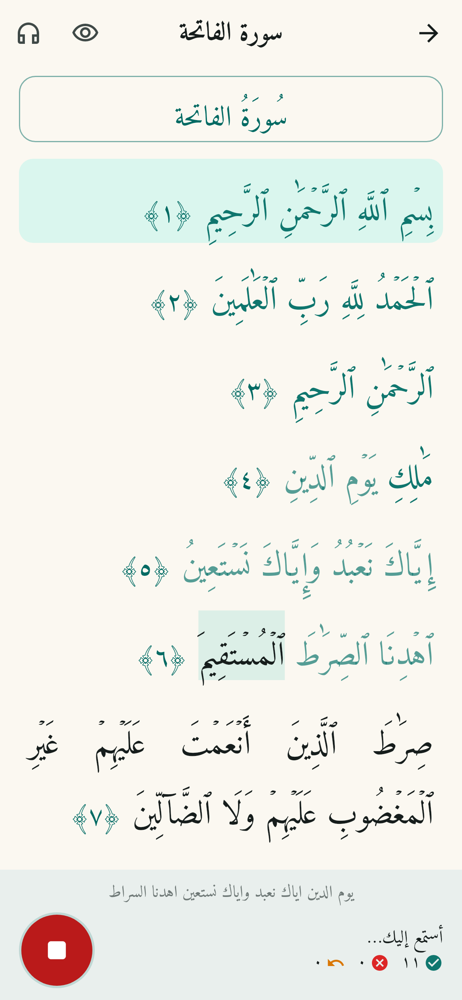
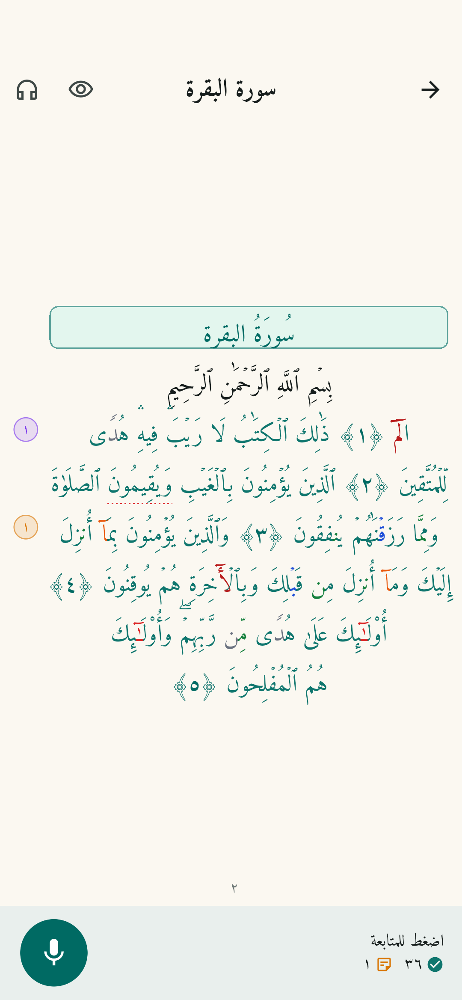
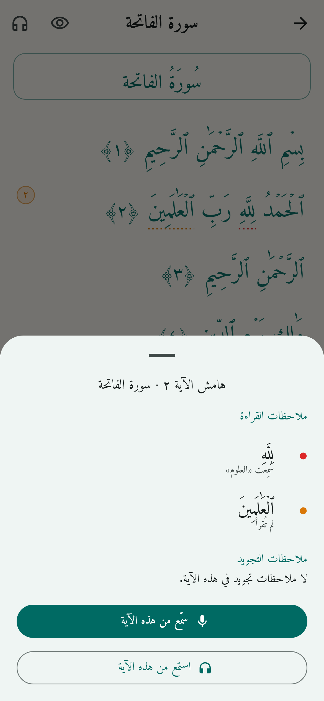
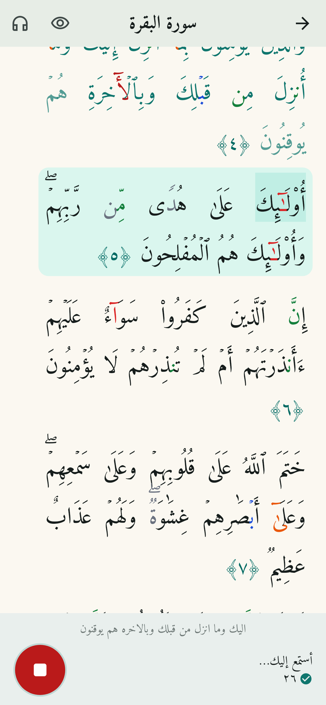
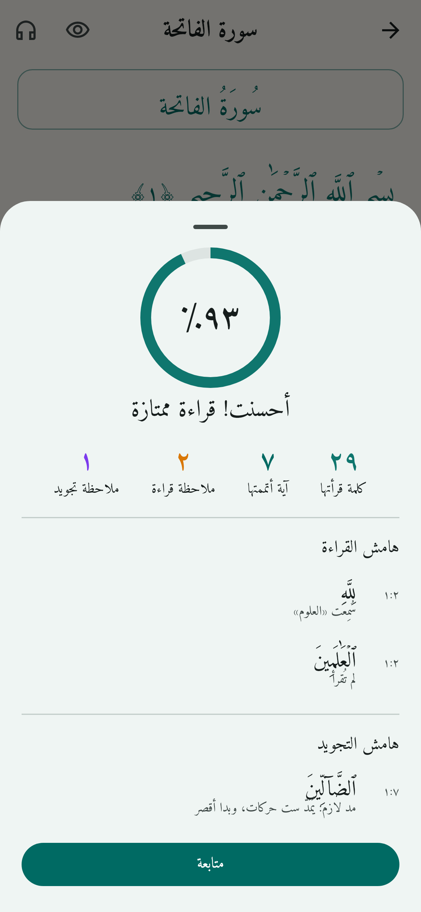
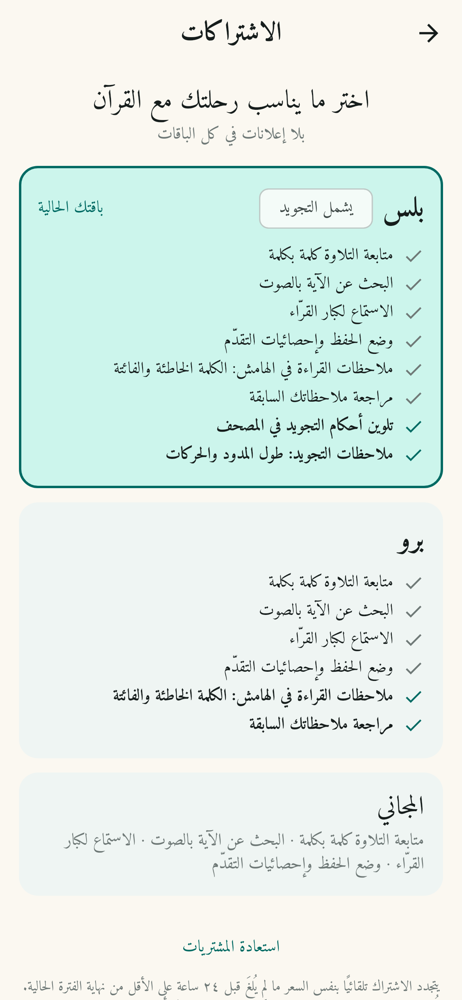

# تلاوة — مساعد تسميع القرآن بالذكاء الاصطناعي

تطبيق (iOS و Android) يستمع إلى تلاوتك، ويتابعها كلمةً كلمة على المصحف. لا يقاطعك إذا أخطأت:
يدوّن ملاحظاته بهدوء **في هامش الآية** (الكلمة الخاطئة أو الفائتة، وفي بلس: أحكام التجويد) لتراجعها متى شئت.

> "تلاوة" اسم مؤقت للمشروع، غيّره كما تشاء.

| أثناء التسميع | الهامش بعد التوقف | هامش الآية |
|---|---|---|
|  |  |  |

| تلوين التجويد (بلس) | ملخص الجلسة | الاشتراكات |
|---|---|---|
|  |  |  |

## المزايا

- **متابعة التلاوة لحظيًا**: تتلوّن الكلمات أثناء قراءتك، ويُظلَّل موضع الكلمة التالية.
- **ملاحظات في الهامش لا تقاطعك**: أثناء القراءة لا يظهر أي لون أحمر ولا رسالة «أخطأت»؛
  تظهر نقطة صغيرة بجانب الآية فيها عدد الملاحظات، وبعد التوقف يوضع خط منقّط خفيف تحت المواضع.
  (يمكن تفعيل إظهارها على الكلمات مباشرة من الإعدادات.)
- **كشف أخطاء القراءة** (برو): كلمة خاطئة (مع ما سُمِع بدلًا منها)، وكلمة فائتة، وتخطّي آية كاملة.
  ويتسامح مع التكرار والرجوع لتصحيح الكلمة، ومع الاستعاذة والبسملة و«صدق الله العظيم».
- **أحكام التجويد** (بلس): تلوين المصحف بالأحكام (المدود، الغنة، الإخفاء، الإدغام، الإقلاب، القلقلة)
  مستخرجة من علامات الضبط في الرسم العثماني نفسه، وملاحظات هادئة إذا قصُر **المد اللازم أو المتصل**
  عن طوله، أو إذا اختلفت **الحركة الإعرابية** في آخر الكلمة.
- **وضع الحفظ**: إخفاء النص حتى تتلوه، مع زر «تلميح» يُظهر الكلمة التالية (ويُحتسب خطأً).
- **البحث بالصوت**: اقرأ أي مقطع ليجد التطبيق السورة والآية.
- **التقدّم**: أيام متتالية، ونشاط الأسبوع، ونسبة الختمة لكل سورة، وقائمة بالأخطاء للمراجعة.
- **الاستماع**: تلاوة الآيات بأصوات عدد من القرّاء (everyayah.com) مع تظليل الآية الحالية.
- **محرّكا تعرّف**: عبر الخادم (أدق) أو **على الجهاز دون إنترنت** (whisper.cpp).
- ثلاثة مستويات لدقة التصحيح: متساهل / عادي / دقيق.
- **بلا إعلانات** في كل الباقات.

## الباقات

| | المجاني | برو | بلس |
|---|:-:|:-:|:-:|
| متابعة التلاوة، البحث بالصوت، الاستماع، وضع الحفظ، الإحصائيات | ✓ | ✓ | ✓ |
| ملاحظات القراءة في الهامش (الخاطئة والفائتة) ومراجعتها | | ✓ | ✓ |
| تلوين أحكام التجويد وملاحظات المدود والحركات | | | ✓ |

الأسعار تُضبط من App Store Connect وGoogle Play Console (التطبيق يعرض السعر القادم من المتجر).
أنشئ اشتراكات متجددة تلقائيًا بهذه المعرّفات:
`quranai.pro.monthly`، `quranai.pro.yearly`، `quranai.plus.monthly`، `quranai.plus.yearly`.

- في Xcode فعّل قدرة **In-App Purchase** لهدف Runner.
- **مهم قبل الإطلاق:** التطبيق يثق حاليًا بإشعار الشراء القادم من المتجر ويحفظ الباقة على الجهاز.
  للإنتاج تحقّق من الإيصال على خادم (App Store Server API / Google Play Developer API)، فهو وحده
  يعرف انتهاء الاشتراك أو إلغاءه؛ مكان ذلك جاهز في `PurchaseVerifier` داخل `lib/billing/subscription.dart`.
- في نسخة التطوير تظهر في صفحة الاشتراكات أزرار لتبديل الباقة للتجربة.

## البنية

```
app/      تطبيق Flutter
  lib/core/       منطق المطابقة (بلا واجهات، ومغطّى بالاختبارات)
    arabic.dart             توحيد الرسم العثماني والإملائي ومقارنة الكلمات
    alignment.dart          محاذاة ما سُمع مع نص المصحف (برمجة ديناميكية)
    recitation_tracker.dart متابعة التلاوة الحيّة وتثبيت الأخطاء
    ayah_search.dart        فهرس للبحث عن الآية من الصوت
    tajweed.dart            استخراج أحكام التجويد من علامات الرسم العثماني
    recitation_review.dart  مراجعة ما بعد الجلسة: طول المدود والحركة الأخيرة
  lib/billing/    الاشتراكات (in_app_purchase)
  lib/asr/        محرّكات التعرّف: server_engine (WebSocket) و on_device_engine (whisper.cpp)
  lib/features/   الشاشات: المصحف، التسميع، البحث الصوتي، التقدّم، الإعدادات
server/   خادم Python (FastAPI) يشغّل نموذج Whisper المدرّب على التلاوة
tools/    بناء بيانات المصحف، وتحويل النموذج إلى ggml للعمل على الجهاز
```

### كيف يعمل كشف الأخطاء

1. يحوّل المحرّك الصوت إلى نص (Whisper المدرّب على القرآن: `tarteel-ai/whisper-base-ar-quran`).
2. يُوحَّد النصّان (المسموع والمصحف): حذف التشكيل وعلامات الضبط، وتوحيد الهمزات والألفات
   (فتصبح `ٱلصَّلَوٰةَ` = `الصلاة`، و`ٱلۡعَٰلَمِينَ` = `العالمين`).
3. تُحاذى الكلمات المسموعة مع كلمات المصحف بخوارزمية تشبه Needleman–Wunsch مع تكلفة
   «قفز» متدرّجة، ودمج كلمات (يَٰٓأَيُّهَا = يا أيها، والحروف المقطّعة: الٓمٓ = ألف لام ميم).
4. لا يُسجَّل الخطأ إلا بعد استقرار النص (Whisper يعدّل آخر كلماته باستمرار)، بينما يظهر التقدّم فورًا.

### كيف يعمل التجويد (بلس)

- **الأحكام** تُستخرج من المصحف نفسه: النون أو الميم بلا سكون تعني إخفاءً أو إدغامًا، والتنوين المتتابع
  (ٗ ٞ ٖ) يسبق إخفاءً أو إدغامًا، والميم الصغيرة (ۢ) إقلاب، وعلامة المد (ٓ) تعني مدًّا أطول من حركتين،
  ويُحدَّد نوعه مما يليه (همزة = متصل، سكون أو شدة = لازم، همزة في الكلمة التالية = منفصل).
- **طول المد**: يعيد الخادم توقيت كل كلمة، فيقيس التطبيق سرعة القارئ نفسه (ثوانٍ لكل حرف) من كلماته
  العادية، ثم يقارن بها الكلمات التي فيها مد لازم أو متصل. لا يُسجَّل شيء إلا إذا قصُر المد بوضوح، لأن
  الملاحظة الخاطئة أسوأ من ملاحظة فائتة. المد المنفصل لا يُفحص لأن قصره جائز في طريق الطيبة.
- **الحركة الأخيرة** تُقارن فقط إذا أخرج نموذج التعرّف نصًّا مشكولًا، وتُستثنى مواضع الوقف.
- **حدود معروفة:** دقة توقيت الكلمات من Whisper تقريبية ولم تُختبر بعد على تلاوات حقيقية، فالعتبات
  (`ReviewConfig`) قابلة للضبط. النموذج الافتراضي `whisper-base-ar-quran` غالبًا لا يُخرج التشكيل، ففحص
  الحركات يحتاج نموذجًا يُخرجه. وأحكام مثل الغنة والإخفاء تُلوَّن ولا تُفحص صوتيًا بعد.
  وتوقيت الكلمات متاح عبر الخادم فقط؛ المحرّك على الجهاز يعطي النص وحده.

## تحميل التطبيق (ملفات التشغيل)

يبني GitHub Actions ملفات التطبيق تلقائيًا (ملف `.github/workflows/build.yml`):

- **أندرويد (APK):** يُبنى مع كل تعديل على التطبيق. من صفحة المستودع افتح **Actions ← Build app** واختر
  آخر تشغيل ناجح، ثم نزّل `quran-ai-android` من قسم Artifacts. فكّ الضغط، وانقل `quran-ai.apk` إلى
  الهاتف، واسمح بالتثبيت من مصادر غير معروفة.
- **ويندوز:** يُبنى مع كل تعديل أيضًا. من **Actions ← Build app** نزّل `quran-ai-windows`، وفكّ الضغط
  مرتين، ثم شغّل `quran_ai.exe` (ويندوز 10 أو أحدث، 64 بت). عند أول تشغيل قد يظهر تحذير SmartScreen لأن
  الملف غير موقّع: اضغط «مزيد من المعلومات» ثم «تشغيل على أي حال». الاشتراك لا يتم من ويندوز (لا يوجد
  متجر)، بل من تطبيق الجوال.
- **آيفون (IPA غير موقّع):** من **Actions ← Build app ← Run workflow**. آبل لا تسمح بتثبيت تطبيق غير
  موقّع مباشرة؛ ثبّته بأداة مثل Sideloadly أو AltStore بحساب Apple ID (تنتهي صلاحيته بعد 7 أيام للحساب
  المجاني)، أو اشترك في Apple Developer Program (99 دولارًا سنويًا) ووزّعه عبر TestFlight.
- الـ APK الحالي موقّع بمفتاح التطوير؛ للنشر على Google Play أنشئ مفتاح توقيع خاصًّا (keystore).

## التشغيل

### الخادم

```bash
docker compose up -d          # أو: server/run.sh (لينكس/ماك) · server\run.bat (ويندوز)
```

ثم ضع عنوان الجهاز في التطبيق، مثل `http://192.168.1.10:8000` (الهاتف والجهاز على نفس الشبكة).

```bash
cd server
pip install -r requirements.txt
uvicorn quran_asr.main:app --host 0.0.0.0 --port 8000
# أو
docker build -t quran-asr server && docker run -p 8000:8000 quran-asr
```

متغيرات البيئة: `QURAN_ASR_MODEL` (النموذج)، `QURAN_ASR_DEVICE` (`auto`/`cpu`/`cuda`/`mps`)،
`QURAN_ASR_API_KEY` (مفتاح وصول اختياري).

واجهات الخادم: `GET /health`، و`POST /v1/transcribe` (ملف WAV)، و`WS /v1/stream`
(صوت PCM16 أحادي 16kHz ← أحداث `partial`/`final` لكل مقطع، والـ `final` يحمل توقيت كل كلمة؛
التفاصيل في `server/quran_asr/main.py`). رؤوس الانتباه المستخدمة للتوقيت تؤخذ من `whisper-base`
تلقائيًا، ويمكن تغييرها بـ `QURAN_ASR_ALIGNMENT_HEADS`.

### التطبيق

```bash
cd app
flutter pub get
flutter run
```

- من **الإعدادات** ضع عنوان الخادم (المحاكي على Android يصل إلى جهازك عبر `http://10.0.2.2:8000`).
- للعمل **على الجهاز**: حوّل النموذج بـ `tools/convert_model_to_ggml.sh`، وارفع الملف الناتج،
  وضع رابطه في الإعدادات. إن تُرك فارغًا يُستخدم نموذج Whisper العام (أقل دقة في التلاوة).
- iOS يتطلب 15.6 فأعلى (بسبب whisper.cpp).

### الاختبارات

```bash
cd app && flutter test        # المطابقة، البحث، المتابعة الحيّة، وتدفّق الجلسة
cd server && pip install -r requirements-dev.txt && pytest
```

## التسويق

خطة الإعلان المموّل وتصاميمه الجاهزة في [`docs/marketing`](docs/marketing/README.md).

## ما الذي ينقص للوصول إلى مستوى ترتيل

- **تجويد أعمق**: فحص الغنة والإخفاء والقلقلة صوتيًا، وأخطاء الحركات داخل الكلمة؛ يحتاج نموذجًا
  صوتيًّا (phoneme) مدرّبًا على التلاوة، ومعايرة العتبات الحالية على تسجيلات حقيقية.
- **صفحات مصحف المدينة (604 صفحة)** بخط KFGQPC بدل العرض المتصل الحالي.
- الحسابات والمزامنة بين الأجهزة، وخطط الحفظ والمراجعة والتذكيرات.
- الترجمات والتفسير، وتحسين النموذج بتدريبه على بيانات أكثر (أطفال، نساء، قراءات مختلفة).
- رفع دقة النموذج: `whisper-base` صغير وسريع؛ يمكن تجربة نموذج أكبر على الخادم.

## المصادر والتراخيص

- نص المصحف: [مشروع تنزيل](https://tanzil.net) (الرسم العثماني، رواية حفص)، دون تعديل على النص.
  يُعاد بناؤه بـ `tools/build_quran_data.py`.
- الخط: [Amiri Quran](https://github.com/aliftype/amiri) — رخصة SIL OFL (`app/assets/fonts/OFL-Amiri.txt`).
- التلاوات الصوتية: [everyayah.com](https://everyayah.com).
- نموذج التعرف: [tarteel-ai/whisper-base-ar-quran](https://huggingface.co/tarteel-ai/whisper-base-ar-quran).
