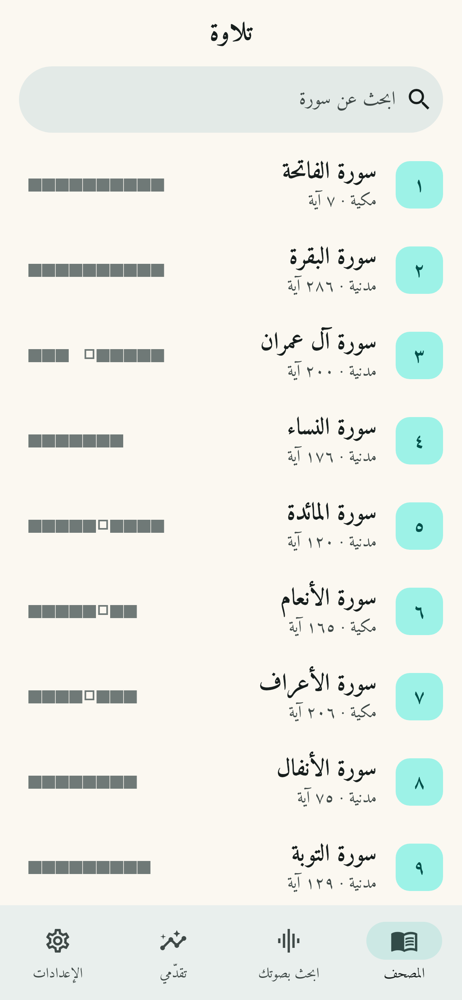

# تلاوة — مساعد تسميع القرآن بالذكاء الاصطناعي

تطبيق (iOS و Android) يستمع إلى تلاوتك، ويتابعها كلمةً كلمة على المصحف، وينبّهك إلى الأخطاء:
الكلمة الخاطئة، والكلمة الفائتة، مع وضعٍ للحفظ يُخفي الآيات حتى تتلوها.

> "تلاوة" اسم مؤقت للمشروع، غيّره كما تشاء.

| الصفحة الرئيسية | أثناء التسميع | ملخص الجلسة |
|---|---|---|
|  |  |  |

## المزايا

- **متابعة التلاوة لحظيًا**: تتلوّن الكلمات أثناء قراءتك، ويُظلَّل موضع الكلمة التالية.
- **كشف الأخطاء**: كلمة خاطئة (مع ما سُمِع بدلًا منها)، وكلمة فائتة، وتخطّي آية كاملة.
  ويتسامح مع التكرار والرجوع لتصحيح الكلمة، ومع الاستعاذة والبسملة و«صدق الله العظيم».
- **وضع الحفظ**: إخفاء النص حتى تتلوه، مع زر «تلميح» يُظهر الكلمة التالية (ويُحتسب خطأً).
- **البحث بالصوت**: اقرأ أي مقطع ليجد التطبيق السورة والآية.
- **التقدّم**: أيام متتالية، ونشاط الأسبوع، ونسبة الختمة لكل سورة، وقائمة بالأخطاء للمراجعة.
- **الاستماع**: تلاوة الآيات بأصوات عدد من القرّاء (everyayah.com) مع تظليل الآية الحالية.
- **محرّكا تعرّف**: عبر الخادم (أدق) أو **على الجهاز دون إنترنت** (whisper.cpp).
- ثلاثة مستويات لدقة التصحيح: متساهل / عادي / دقيق.

## البنية

```
app/      تطبيق Flutter
  lib/core/       منطق المطابقة (بلا واجهات، ومغطّى بالاختبارات)
    arabic.dart             توحيد الرسم العثماني والإملائي ومقارنة الكلمات
    alignment.dart          محاذاة ما سُمع مع نص المصحف (برمجة ديناميكية)
    recitation_tracker.dart متابعة التلاوة الحيّة وتثبيت الأخطاء
    ayah_search.dart        فهرس للبحث عن الآية من الصوت
  lib/asr/        محرّكات التعرّف: server_engine (WebSocket) و on_device_engine (whisper.cpp)
  lib/features/   الشاشات: المصحف، التسميع، البحث الصوتي، التقدّم، الإعدادات
server/   خادم Python (FastAPI) يشغّل نموذج Whisper المدرّب على التلاوة
tools/    بناء بيانات المصحف، وتحويل النموذج إلى ggml للعمل على الجهاز
```

### كيف يعمل كشف الأخطاء

1. يحوّل المحرّك الصوت إلى نص (Whisper المدرّب على القرآن: `tarteel-ai/whisper-base-ar-quran`).
2. يُوحَّد النصّان (المسموع والمصحف): حذف التشكيل وعلامات الضبط، وتوحيد الهمزات والألفات
   (فتصبح `ٱلصَّلَوٰةَ` = `الصلاة`، و`ٱلۡعَٰلَمِينَ` = `العالمين`).
3. تُحاذى الكلمات المسموعة مع كلمات المصحف بخوارزمية تشبه Needleman–Wunsch مع تكلفة
   «قفز» متدرّجة، ودمج كلمات (يَٰٓأَيُّهَا = يا أيها، والحروف المقطّعة: الٓمٓ = ألف لام ميم).
4. لا يُعلَن الخطأ إلا بعد استقرار النص (Whisper يعدّل آخر كلماته باستمرار)، بينما يظهر التقدّم فورًا.

## التشغيل

### الخادم

```bash
cd server
pip install -r requirements.txt
uvicorn quran_asr.main:app --host 0.0.0.0 --port 8000
# أو
docker build -t quran-asr server && docker run -p 8000:8000 quran-asr
```

متغيرات البيئة: `QURAN_ASR_MODEL` (النموذج)، `QURAN_ASR_DEVICE` (`auto`/`cpu`/`cuda`/`mps`)،
`QURAN_ASR_API_KEY` (مفتاح وصول اختياري).

واجهات الخادم: `GET /health`، و`POST /v1/transcribe` (ملف WAV)، و`WS /v1/stream`
(صوت PCM16 أحادي 16kHz ← أحداث `partial`/`final` لكل مقطع؛ التفاصيل في `server/quran_asr/main.py`).

### التطبيق

```bash
cd app
flutter pub get
flutter run
```

- من **الإعدادات** ضع عنوان الخادم (المحاكي على Android يصل إلى جهازك عبر `http://10.0.2.2:8000`).
- للعمل **على الجهاز**: حوّل النموذج بـ `tools/convert_model_to_ggml.sh`، وارفع الملف الناتج،
  وضع رابطه في الإعدادات. إن تُرك فارغًا يُستخدم نموذج Whisper العام (أقل دقة في التلاوة).
- iOS يتطلب 15.6 فأعلى (بسبب whisper.cpp).

### الاختبارات

```bash
cd app && flutter test        # المطابقة، البحث، المتابعة الحيّة، وتدفّق الجلسة
cd server && pip install -r requirements-dev.txt && pytest
```

## ما الذي ينقص للوصول إلى مستوى ترتيل

- **أخطاء التشكيل والتجويد**: المطابقة الحالية على مستوى الحروف دون الحركات؛ تحتاج نموذجًا
  يُخرج نصًّا مشكولًا أو نموذجًا صوتيًّا (phoneme) مدرّبًا على التلاوة.
- **صفحات مصحف المدينة (604 صفحة)** بخط KFGQPC بدل العرض المتصل الحالي.
- الحسابات والمزامنة بين الأجهزة، وخطط الحفظ والمراجعة والتذكيرات.
- الترجمات والتفسير، وتحسين النموذج بتدريبه على بيانات أكثر (أطفال، نساء، قراءات مختلفة).
- رفع دقة النموذج: `whisper-base` صغير وسريع؛ يمكن تجربة نموذج أكبر على الخادم.

## المصادر والتراخيص

- نص المصحف: [مشروع تنزيل](https://tanzil.net) (الرسم العثماني، رواية حفص)، دون تعديل على النص.
  يُعاد بناؤه بـ `tools/build_quran_data.py`.
- الخط: [Amiri Quran](https://github.com/aliftype/amiri) — رخصة SIL OFL (`app/assets/fonts/OFL-Amiri.txt`).
- التلاوات الصوتية: [everyayah.com](https://everyayah.com).
- نموذج التعرف: [tarteel-ai/whisper-base-ar-quran](https://huggingface.co/tarteel-ai/whisper-base-ar-quran).
